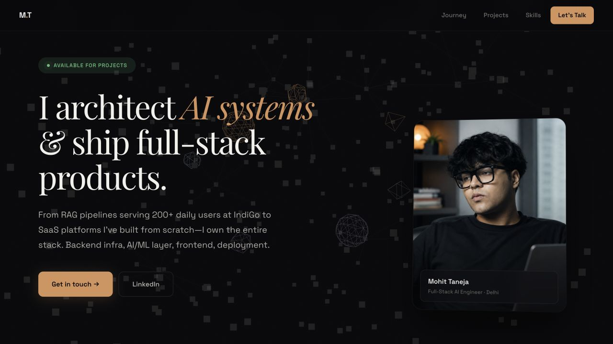

# Mohit Taneja — Data Science & Applied AI Portfolio

A static, career-focused portfolio for selected enterprise data engineering,
machine-learning research, applied AI, and end-to-end product work.

[View the live portfolio](https://portfolio-mohittaneja.netlify.app)



## What this site covers

- Professional experience across applied AI, data engineering, and product
  development
- IndiGo Flight Operations and AskPrism outcomes, followed by selected AI,
  research, SaaS, healthcare, video, marketplace, and client projects
- Technical strengths across Python, TypeScript, LLM applications, data
  systems, and cloud deployment
- A builder-mindset section covering technical curiosity, ownership,
  cross-functional startup experience, and ambition
- Direct contact links for Data Science, Applied AI, and AI/ML engineering roles

## Implementation

The site is deliberately lightweight:

- One static `index.html`
- Responsive CSS and interaction code embedded with the page
- A Three.js background loaded from a CDN
- No build step or runtime server
- Vercel/Netlify-compatible fallback routing

## Run locally

Any static file server will work:

```bash
python3 -m http.server 8000
```

Then open <http://localhost:8000>.

## Repository map

```text
.
├── index.html       # page structure, styles, content, and interactions
├── photo.jpg        # profile image
├── portfolio-preview.jpg
└── netlify.toml     # static-host fallback routing
```

## Content integrity

Employment metrics and private/client project details should only be changed
when they can be supported by internal records or a public project source. Some
projects are intentionally presented as case studies without source-code links
because the underlying repositories or client systems are private.
